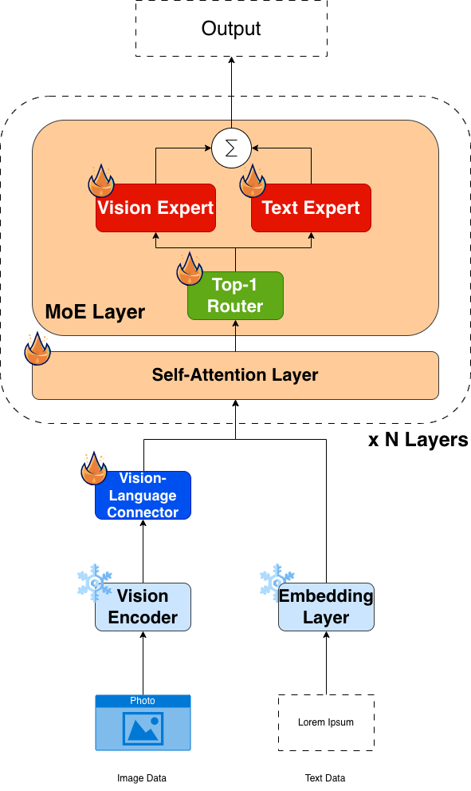

# Research Code: Expert Collapse and Compositional Failure in Simple Multimodal MoE

[](LICENSE)
[](pyproject.toml)
[](https://github.com/astral-sh/uv)
[](https://github.com/astral-sh/ruff)
[](https://github.com/anthonyticinovic/MoE-Specialisation/actions/workflows/ci.yml)
[](https://proceedings.mlr.press/v332/)

Research code for [*Expert Collapse and Compositional Failure in Simple Multimodal MoE*](https://raw.githubusercontent.com/mlresearch/v332/main/assets/ticinovic26a/ticinovic26a.pdf)
(Ticinovic, 2026), published at the **AAAI 2026 Workshop on Bias in Multimodal
AI: Representation, Risk, and Repair** ([PMLR v332](https://proceedings.mlr.press/v332/)).
See the paper for the full method and results.

## Run it in 30 seconds (no GPU, no data, no downloads)

A local skeleton of the whole pipeline - Stage 0 → 1 → 2 → 2.5 → 3, the dense
control and two analysis scripts - on a laptop CPU:

```bash
uv sync --group dev
make demo
```

Under 30 seconds on an M4 Pro. It writes 12 checkpoints, routing metrics, a
figure per metric, the routing-ablation results and a one-page
`demo_output/demo_report.md` listing them.

The report opens with 16 executable invariants: properties that must hold for
the pipeline to be correct. The demo is both a regression test and something a
reader can inspect quickly.

It runs the real `train_stage_*.py` files used on the H100 cluster, pointed at a
miniature config via `MOE_CONFIG`. Only scale and device differ.

`make check` runs lint, tests and the demo. CI runs the same on every push.

## Overview

Can vision/text expert specialisation be imposed on a Mixture-of-Experts (MoE)
language model, and does it survive training? We replace every FFN in
Mistral-7B with two experts, one for visual tokens and one for text, and train
the model to caption images.

**Key findings:**
- Hard routing specialises the experts, but routing collapses once the enforcement is removed.
- Concepts from different modalities share geometric neighbourhoods in the expert latent space, so the experts do not learn disjoint representations.
- A learned soft router (Stage 2.5) recovers meaningful routing after specialisation, but only at some layers.

### Captioning performance (COCO Karpathy test split)

Captioning quality is a diagnostic, not the objective. Full numbers:

| Model | Data | B-4 | METEOR | ROUGE-L | CIDEr |
|---|---|--:|--:|--:|--:|
| LLaVA-v1.5-7B (full FT, reference) | COCO | **38.2** | 23.5 | **57.3** | **111.4** |
| Stage 2 - hard routing (ours) | COCO | 31.9 | **33.3** | 55.4 | 76.2 |
| Stage 3 - soft routing (ours) | COCO → LLaVA-Ins | 4.2 | 12.2 | 29.9 | 8.1 |

Stage 2 is competitive with a fully fine-tuned LLaVA reference, and higher on
METEOR, despite training only two FFN experts under a fixed mask. The Stage 3
drop is the phenomenon under study: soft routing collapses, and the paper's
interpretability analysis dissects why. Baseline from Bucciarelli et al. (2024).

## Architecture



The custom `MoELayer` (`models/moe_layer.py`) supports two routing modes:

- **Hard routing** (Stage 2): a binary mask derived from token position forces visual tokens to Expert 0 and text tokens to Expert 1. No gate is needed since the modality is known.
- **Soft routing** (Stages 2.5 & 3): a learned linear gate produces per-token routing probabilities. Training uses Gumbel-Softmax with a Straight-Through Estimator so the gate receives gradients while dispatch remains sparse.

## Training Pipeline

All stages read paths from `configs/training_config.yaml`. Fill in the `YOUR_PATH_HERE` placeholders before running.

| Stage | Script | What trains | Notes |
|-------|--------|-------------|-------|
| **0** | `models/utils/create_moe_model.py` | - | Creates the MoE model from Mistral-7B |
| **1** | `training_scripts/train_stage_1.py` | VisionLanguageConnector only | CLIP + LLM frozen; 1 GPU |
| **2** | `training_scripts/train_stage_2.py` | MoE experts (hard routing) | Router frozen; FSDP (run on 4× H100) |
| **2.5** | `training_scripts/train_stage_2.5.py` | Router/gate only | Experts frozen; introduces soft routing |
| **3** | `training_scripts/train_stage_3.py` | Self-attn + router + experts | End-to-end; LLaVA-Instruct data |
| Dense | `training_scripts/train_dense.py` | Standard Mistral FFN | Control baseline |

### Requirements & data

This is refactored research code, not a product. Before anything will run:

- **No trained checkpoints.** Reproducing a result means running Stages 0→3
  yourself; every analysis and evaluation script needs a checkpoint you trained.
  This may change.
- **No datasets or sample images.** Download COCO 2017 (train/val + caption and
  instance annotations) and LLaVA-Instruct-150K, plus local copies of
  Mistral-7B-v0.3 and CLIP ViT-L/14, then point
  `configs/training_config.yaml` at them.
- **Hardware.** Stage 1 needs one GPU; Stages 2–3 use FSDP and need ≥2×
  A100/H100-class. The SLURM scripts in [`hpc/`](hpc/README.md) target an H100
  cluster: set paths and modules in `hpc/cluster_env.sh` (or by environment
  variable) and edit the `#SBATCH` headers per cluster.
- **No published metrics yet.** The Stage 3 metric files behind the paper's
  routing figures are not in the repository, so `make figures` has nothing to
  plot. The regeneration path is in place - see
  [`paper_metrics/`](paper_metrics/README.md).

### Setup

Using [uv](https://docs.astral.sh/uv/), recommended for local development:

```bash
git clone https://github.com/anthonyticinovic/MoE-Specialisation.git
cd MoE-Specialisation
uv sync                       # creates .venv from the pinned uv.lock
# prefix commands with `uv run`, e.g. uv run python -m models.utils.create_moe_model ...
```

On HPC/SLURM, where uv may be unavailable on compute nodes:

```bash
pip install -r requirements.txt   # generated export of uv.lock
```

Then fill in the `YOUR_PATH_HERE` placeholders in
`configs/training_config.yaml`. `load_config()` validates them on startup and
fails with a message naming any left unfilled.

### Running the stages

| Step | Command | Produces |
|------|---------|----------|
| 0 | `python -m models.utils.create_moe_model --base-model <Mistral-7B> --output <MoE>` | MoE model dir (`trust_remote_code`) |
| 1 | `python training_scripts/train_stage_1.py` | `vision_connector_stage1_best.pth` |
| 2 | `torchrun --nproc_per_node=4 training_scripts/train_stage_2.py` | `stage2_checkpoints/llm_stage2_best.pth` |
| 2.5 | `torchrun --nproc_per_node=4 training_scripts/train_stage_2.5.py` | `stage2_5_checkpoints/` (learned router) |
| 3 | `torchrun --nproc_per_node=4 training_scripts/train_stage_3.py` | `stage3_checkpoints/` + `outputs/expert_metrics/` |
| dense | `torchrun --nproc_per_node=4 training_scripts/train_dense.py` | `dense_checkpoints/` (control baseline) |

`export PYTHONPATH="${PWD}:${PYTHONPATH}"` first, so `trust_remote_code` can
find the custom model classes. Each stage has a SLURM wrapper -
`sbatch hpc/training_scripts/train_stage_<n>.sbatch`. Before submitting, set
your checkout and virtualenv paths in `hpc/cluster_env.sh` (or export
`MOE_PROJECT_DIR` / `MOE_VENV`) and adapt the `#SBATCH` headers. See
[`hpc/README.md`](hpc/README.md).

Stage 3 writes the `expert_metrics/` that
[`paper_metrics/`](paper_metrics/README.md) expects, so a completed run makes
`make figures` work without a GPU thereafter. Then run the analyses - see
[`docs/running-the-analyses.md`](docs/running-the-analyses.md).

## Analysis Scripts

Everything in `analysis_scripts/` needs a checkpoint you have trained. Paths
resolve through `MOE_CONFIG`, falling back to `configs/training_config.yaml`,
and the device is CUDA or CPU automatically - the same mechanism the demo uses
to drive them.

| Script | Question it answers |
|---|---|
| `routing_ablation_experiment.py` | Does swapping the two experts cost loss? (the specialisation check `make demo` runs) |
| `plot_expert_metrics.py` | How did expert load, entropy and confidence move across Stage 3 epochs? |
| `cross_concept_similarity_matrix.py` | How similar are image and text representations of the same concept, layer by layer? |
| `cross_modality_purity.py` | How separable are the two experts' representations for one concept? |
| `layer_clustering_analysis.py` | Do per-layer activations cluster by modality or by concept? |
| `compositional_case_study.py` | Colour–object binding: does the model compose attributes? |
| `pope_evaluation/` | Object hallucination (random / popular / adversarial) |
| `karpathy_evaluation/` | COCO Karpathy retrieval (R@k) and captioning (CIDEr, BLEU, METEOR, ROUGE) |
| `llava_evaluation/` | LLaVA-Wild open-ended instruction following |

Commands for all of these are in
[`docs/running-the-analyses.md`](docs/running-the-analyses.md), and each
evaluation sub-pipeline has its own README with the full loop and expected
outputs. Output goes to `results/`, which is git-ignored.

## Repository Structure

```
MoE-Specialisation/
├── models/
│   ├── moe_layer.py          # MoELayer: hard and soft routing
│   ├── custom_mistral.py     # MistralMoEConfig, MistralMoEForCausalLM
│   ├── vl_connector.py       # VisionLanguageConnector (CLIP→LLM projection)
│   └── utils/
│       ├── create_moe_model.py   # Build MoE model from Mistral-7B
│       ├── checkpoints.py        # Cross-stage checkpoint reading, guarded
│       └── common.py             # Shared helpers (config, device, seed, logging)
├── data/
│   ├── COCO_loader.py        # COCO captions dataset
│   └── LLaVA_loader.py       # LLaVA-Instruct-150K dataset
├── training_scripts/         # One script per training stage
│   └── _lib/                 # Shared runtime, pipeline and metric code + Stage 3 setup
├── analysis_scripts/         # Expert analysis and benchmark evaluation
│   ├── _lib/                 # Shared model loading, I/O and plotting helpers
│   ├── karpathy_evaluation/  # COCO Karpathy split pipeline
│   ├── pope_evaluation/      # POPE hallucination benchmark
│   └── llava_evaluation/     # LLaVA-Wild evaluation
├── demo/                     # CPU end-to-end demo: fixtures, runner, invariants
├── docs/
│   ├── design.md             # Why the architecture and pipeline are shaped this way
│   └── running-the-analyses.md  # Every analysis/benchmark command
├── tests/                    # CPU-only pytest suite + behavioural oracle
├── paper_metrics/            # Committed Stage 3 metrics for `make figures`
├── configs/
│   ├── training_config.yaml  # All paths + hyperparameters (edit this first)
│   └── *.json                # Per-analysis configs
└── hpc/
    ├── cluster_env.sh        # Cluster paths and modules, sourced by every job
    ├── training_scripts/     # SLURM job scripts for training
    └── model_scripts/        # SLURM job script for model creation
```

## Dependencies

`uv.lock` pins the exact dependency set the results were produced with.
`transformers` is floored at 4.56 (where `from_pretrained(dtype=...)` was
introduced) and capped below 5, which changes Mistral internals.

## Development

```bash
uv sync --group dev          # runtime + dev tooling
uv run pre-commit install

make lint     # ruff + ruff-format, whole repo, and mypy on the core
make format   # apply ruff formatting
make test     # CPU-only pytest suite (~10s)
make demo     # the whole pipeline on CPU against synthetic fixtures
make check    # lint + test + demo
```

The suite covers four levels:

| Level | Where | What it protects |
|---|---|---|
| Numerics | `tests/test_training_dry_run.py` | A tiny synthetic model must reproduce a recorded loss and grad-norm bit-for-bit. Drift means a refactor changed training numerics. |
| Behaviour | `tests/test_training_steps.py`, `tests/test_analysis_model_loading.py`, `tests/test_expert_metrics_pipeline.py` | Each stage runs a real epoch, must change exactly the parameters it claims to train with gradients reaching all of them, and must resume from its own checkpoint. The analysis loaders and the metrics→figures pipeline then run against that output. |
| Structure | `tests/test_training_scripts_structure.py`, `tests/test_analysis_lib.py` | Scripts stay inert on import, reuse `_lib` instead of re-implementing FSDP, and never load weights with a bare `strict=False`. No analysis script hardcodes the config path or defaults to CUDA, either of which would put it out of the demo's reach. No file over 800 lines. SLURM scripts must point at files that exist. |
| End-to-end | `make demo` | 16 invariants over a full CPU run, including the routing ablation and the figure pipeline. A partial run (`--stages 0 1`) skips checks for stages that did not run. |

## Citation

```bibtex
@inproceedings{ticinovic2026expert,
  title     = {Expert Collapse and Compositional Failure in Simple Multimodal MoE},
  author    = {Ticinovic, Anthony and Han, Caren},
  booktitle = {Proceedings of the AAAI 2026 Workshop on Bias in Multimodal AI: Representation, Risk, and Repair},
  series    = {Proceedings of Machine Learning Research},
  volume    = {332},
  year      = {2026},
  month     = jan,
  address   = {Singapore},
  publisher = {PMLR},
  url       = {https://proceedings.mlr.press/v332/}
}
```
